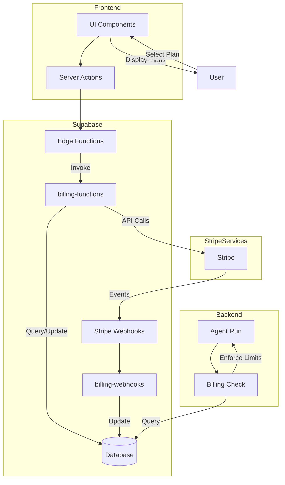
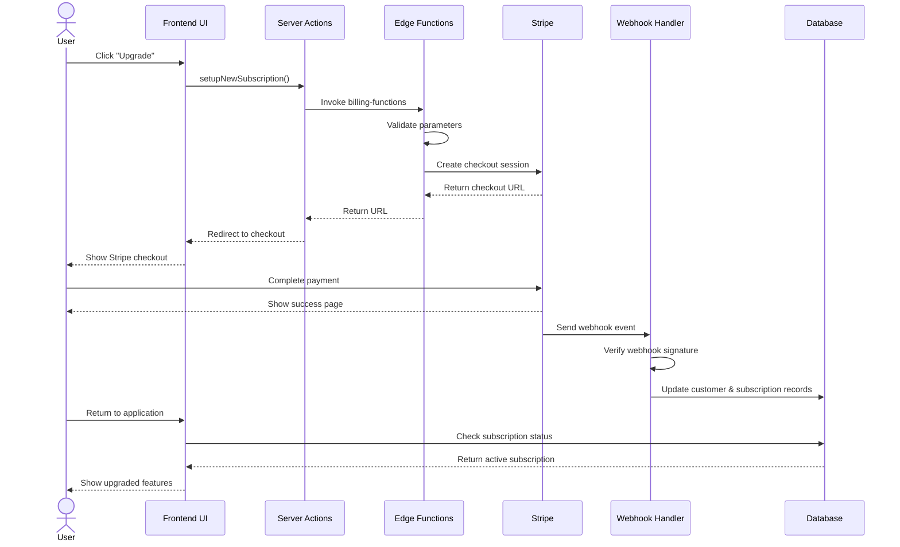
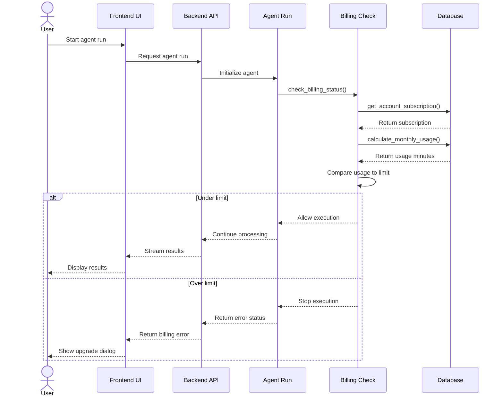

# Payment and Subscription Features

This document provides a detailed overview of the payment and subscription system implemented in the project. The system uses Stripe as the payment processor and integrates with the application through Supabase functions and database tables.

## Overview Architecture



The payment and subscription system consists of the following components:

1. **Stripe Integration**: Primary payment processor, handling subscription plans, payments, and customer management.
2. **Supabase Edge Functions**: Serverless functions (`billing-functions` and `billing-webhooks`) that communicate with Stripe's API.
3. **Database Structure**: Supabase PostgreSQL tables for billing customers and subscriptions.
4. **Backend Logic**: Python utilities in `billing.py` that handle usage limits and permission checks.
5. **Frontend Components**: React components and hooks to display subscription plans, usage limits, and handle upgrade flows.

## Subscription Plans & Usage Limits

### Plan Structure

The system defines three subscription tiers in `backend/utils/billing.py`:

```python
SUBSCRIPTION_TIERS = {
    'price_1RGJ9GG6l1KZGqIroxSqgphC': {'name': 'free', 'minutes': 8},
    'price_1RGJ9LG6l1KZGqIrd9pwzeNW': {'name': 'base', 'minutes': 300},
    'price_1RGJ9JG6l1KZGqIrVUU4ZRv6': {'name': 'extra', 'minutes': 2400}
}
```

These plans offer different usage limits based on minutes of agent usage per month:
- **Free**: 8 minutes/month
- **Base** (Pro): 300 minutes/month ($29)
- **Extra** (Enterprise): 2400 minutes/month ($199)

The frontend displays these plans in `frontend/src/lib/home.tsx` with pricing, descriptions, and features.

### Usage Tracking

The system tracks usage as follows:

1. Each agent run is recorded in the `agent_runs` table with `started_at` and `completed_at` timestamps.
2. The `calculate_monthly_usage` function in `billing.py` calculates total run time for the current month.
3. Before each agent iteration, the system checks usage against the account's plan limit.

## Database Structure

Billing data is stored in two main tables:

### `basejump.billing_customers`

Stores customer information for the billing provider:

- `account_id`: UUID reference to the user's account
- `id`: Stripe customer ID (primary key)
- `email`: Email address for invoicing
- `active`: Customer status flag
- `provider`: The payment provider (expected to be "stripe")

### `basejump.billing_subscriptions`

Tracks subscription details:

- `id`: Stripe subscription ID
- `account_id`: UUID of the account
- `billing_customer_id`: Reference to the customer record
- `status`: Subscription status (enum: 'trialing', 'active', 'canceled', etc.)
- `price_id`: Stripe price ID that created this subscription
- `plan_name`: Human-readable plan name
- Various timing fields: `current_period_start`, `current_period_end`, `trial_start`, etc.

## Backend Implementation

### Usage Checks

The core subscription limit enforcement happens in `backend/utils/billing.py` with the following functions:

1. **`get_account_subscription`**: Retrieves the active subscription for an account.
2. **`calculate_monthly_usage`**: Calculates total agent run minutes for the current month.
3. **`check_billing_status`**: Determines if an account can run agents based on subscription and usage.

The usage limits are bypassed in local development mode:
```python
if config.ENV_MODE == EnvMode.LOCAL:
    logger.info("Running in local development mode - billing checks are disabled")
    return True, "Local development mode - billing disabled", {
        "price_id": "local_dev",
        "plan_name": "Local Development",
        "minutes_limit": "no limit"
    }
```

### Integration Points

Billing checks are performed:

1. **Agent Run Start**: When `run_agent` is called in `backend/agent/run.py`.
2. **Per Iteration**: Before each iteration of the agent loop to prevent exceeding limits during execution.

## Frontend Implementation

### Components

1. **Plan Comparison (`frontend/src/components/billing/plan-comparison.tsx`)**: 
   - Displays available subscription plans
   - Shows current plan
   - Provides upgrade buttons

2. **Usage Limit Alert (`frontend/src/components/billing/usage-limit-alert.tsx`)**:
   - Shows when usage limits are reached
   - Displays usage stats and limit
   - Offers plan upgrade options

3. **Billing Error Hook (`frontend/src/hooks/useBillingError.ts`)**:
   - Handles billing-related errors
   - Formats error messages
   - Manages the display of billing alerts

### Server Actions

The frontend uses Next.js server actions (`frontend/src/lib/actions/billing.ts`) to interact with the billing system:

1. **`setupNewSubscription`**: Creates a new subscription for an account.
2. **`manageSubscription`**: Opens the billing portal to manage an existing subscription.

Both functions invoke the Supabase edge function `billing-functions` with appropriate parameters.

## Supabase Edge Functions

### Billing Functions

The `billing-functions` edge function (`backend/supabase/functions/billing-functions/index.ts`) exposes several endpoints:

1. **`get_plans`**: Returns available subscription plans.
2. **`get_billing_portal_url`**: Returns a URL to the Stripe billing portal for an account.
3. **`get_new_subscription_url`**: Returns a URL to setup a new subscription.
4. **`get_billing_status`**: Returns the current billing status for an account.

### Billing Webhooks

The `billing-webhooks` function (`backend/supabase/functions/billing-webhooks/index.ts`) handles Stripe webhook events:

1. Uses `stripeWebhookHandler` from the Basejump package
2. Processes events like subscription created, updated, deleted
3. Updates the database accordingly via `service_role_upsert_customer_subscription`

## Authentication & Security

1. **Row Level Security**: Database tables use RLS policies to ensure users can only access their own billing data.
2. **Function Security**: Functions like `get_account_billing_status` use `security definer` to run with elevated privileges.
3. **Authorization**: The `requireAuthorizedBillingUser` middleware ensures only account owners can access billing functions.
4. **CORS Protection**: Edge functions implement CORS policies to limit access to approved domains.

## Integration Flow

The billing system flow works as follows:

1. User views pricing plans on the frontend
2. User selects a plan and clicks "Upgrade"
3. `setupNewSubscription` server action is called
4. Supabase edge function generates a Stripe checkout URL
5. User completes payment on Stripe
6. Stripe webhook notifies the application
7. Database is updated with new subscription details
8. User can now access features according to their plan

### Subscription Upgrade Flow

The following sequence diagram illustrates the detailed flow when a user upgrades their subscription:



### Usage Limit Check Flow

When a user attempts to use the agent, the system checks if they have remaining usage:



## Development vs Production

The system differentiates between environments:

- **Local Development**: Billing checks are bypassed
- **Staging/Production**: Full billing enforcement
- **CORS Configuration**: Different allowed origins based on environment

## Recommendations for Improvement

Based on the analysis of the current payment and subscription system, here are several recommendations for potential improvements:

1. **More Granular Usage Tracking**
   - **Current:** The system tracks usage in minutes based on agent run time.
   - **Recommendation:** Consider tracking more granular metrics such as token usage, tool calls, or specific feature usage.
   - **Benefit:** Allows for more flexible pricing models and better understanding of user behavior.

2. **Caching Subscription Status**
   - **Current:** Subscription status is checked via database query on each agent iteration.
   - **Recommendation:** Cache subscription status in Redis with a short TTL (e.g., 5 minutes).
   - **Benefit:** Reduces database load and potentially improves performance for long-running agent tasks.

3. **Proactive Usage Notifications**
   - **Current:** Users only see usage alerts when they hit their limit.
   - **Recommendation:** Implement notifications when users reach 75%, 90%, etc. of their usage quota.
   - **Benefit:** Improves user experience by providing advance warning before limits are reached.

4. **Subscription Analytics Dashboard**
   - **Current:** No dedicated analytics view for subscription metrics.
   - **Recommendation:** Create an admin dashboard for monitoring subscription conversions, upgrades, and usage patterns.
   - **Benefit:** Provides insights for business decisions and product improvements.

5. **Usage Rollover or Credits System**
   - **Current:** Usage limits reset completely each month.
   - **Recommendation:** Consider implementing a partial rollover of unused minutes or a credits system.
   - **Benefit:** Increases perceived value for users with variable usage patterns.

6. **Enhanced Security Measures**
   - **Current:** Basic security with RLS and function privileges.
   - **Recommendation:** Implement additional security measures such as rate limiting on billing functions and webhook signature verification logging.
   - **Benefit:** Protects against potential abuse or manipulation of the billing system.

7. **Better Local Development Experience**
   - **Current:** Billing is simply bypassed in local development mode.
   - **Recommendation:** Provide a MockBilling module that simulates different subscription scenarios for testing.
   - **Benefit:** Enables developers to test billing-related UI and logic in development.

## Conclusion

The payment and subscription system provides a complete solution for monetizing the application through tiered plans based on agent usage time. It integrates Stripe for payment processing and leverages Supabase for database storage and serverless function hosting. While the current implementation is functional and follows good practices, implementing the recommendations above would further enhance its robustness, flexibility, and user experience.
