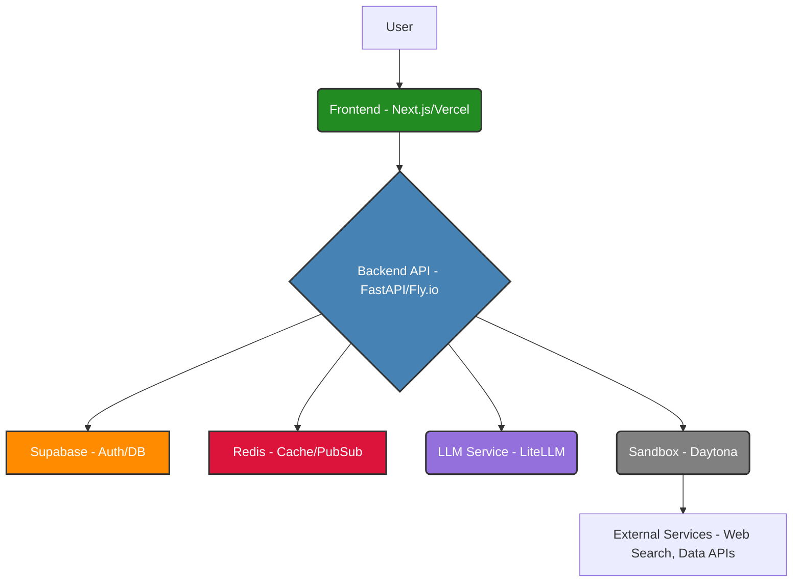

# System Architecture

This document describes the high-level architecture of the Ptah AI Agent project.

## Overview

*(A brief description of the system's purpose and main components.)*

## Components

### Backend (Python/FastAPI)

*   **API Layer:** Handles incoming requests, authentication, routing.
*   **Agent Core:** Manages agent runs, LLM interaction, tool usage.
*   **Sandbox:** Provides isolated environments for code execution, browsing, etc.
*   **Services:** Interfaces with external systems (Supabase, Redis, LLMs, etc.).
*   **Data Model:** Describes the database schema (managed via Supabase/Postgres).

### Frontend (TypeScript/Next.js)

*   **UI Components:** Reusable UI elements (likely Shadcn/Radix).
*   **State Management:** How application state is managed (Zustand).
*   **Routing:** Handled by Next.js App Router.
*   **API Interaction:** How the frontend communicates with the backend API (SWR, fetch).
*   **Authentication:** Handled via Supabase Auth.

### Infrastructure

*   **Hosting:** Fly.io (Backend), Vercel (Frontend).
*   **Database:** Supabase (Postgres).
*   **Caching/PubSub:** Redis.
*   **Sandbox Provider:** Daytona.

## Diagrams

*(Embed or link to architectural diagrams, sequence diagrams, etc.)*

## Key Design Decisions

*(Rationale behind major architectural choices.)*
